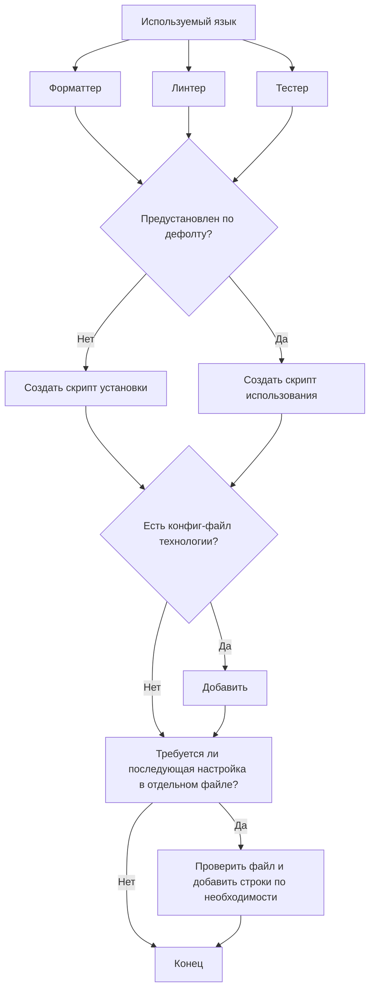

# Вклад в проект 🚀

Спасибо за интерес к нашему проекту. Мы ценим ваше желание внести свой вклад. Пожалуйста, следуйте ниже приведенным инструкциям для настройки инструментов, необходимых для работы с проектом.

## Инструменты 🛠️

Проект использует несколько инструментов для автоматизации процессов, таких как форматирование кода, линтинг и тестирование. В проекте предусмотрены следующие инструменты:

- **Форматтер** ✨: инструмент, автоматически приводящий код в соответствие с установленными стандартами.
- **Линтер** 🧹: инструмент, предназначенный для проверки кода на соответствие стилям и обнаружения потенциальных ошибок.
- **Тестер** 🔍: инструмент для проверки корректности работы кода с помощью юнит-тестов.

### Настройка ⚙️

1. **Используемый язык** 📝

   - Данный проект использует специфический язык для описания и обработки кода. Для его корректной работы необходимо настроить соответствующие инструменты.

2. **Форматтер, Линтер, Тестер** 🔧
   - При установке этих инструментов убедитесь, что они настроены должным образом в соответствии с требованиями проекта.

### Шаги установки 📥

#### 1. Проверка, предустановлены ли инструменты ✅

Прежде чем подключать инструмент (форматтер, линтер или тестер), убедитесь, что он предустановлен в проекте по умолчанию.

- Если инструмент не предустановлен, необходимо создать скрипт для его установки.
- Если инструмент уже присутствует в проекте, переходите к созданию скрипта для его использования.

#### 2. Создание скрипта установки или использования 📝

- **Скрипт установки** 🛠️:
  Если инструмент не был предустановлен, создайте скрипт установки. Для этого проверьте наличие конфигурационного файла для соответствующей технологии. Если файл существует, добавьте в него необходимые строки для настройки.

- **Скрипт использования** 🧑‍💻:
  Если инструмент уже настроен, создайте скрипт, обеспечивающий его использование в проекте.

#### 3. Настройка конфигураций ⚙️

- Если для инструмента уже существует конфигурационный файл, проверьте его настройки, чтобы убедиться, что они соответствуют проекту.
- Если конфигурационный файл отсутствует, уточните, требуется ли отдельная настройка в другом файле. Если да, добавьте необходимые строки в конфигурацию.

### Диаграмма процесса 🔄

### Заключение 🎉

После настройки инструментов убедитесь, что они функционируют корректно, запустив соответствующие команды для линтинга, форматирования и тестирования кода.

Если у вас возникли вопросы или предложения, не стесняйтесь создать issue или сделать pull request! 💡
